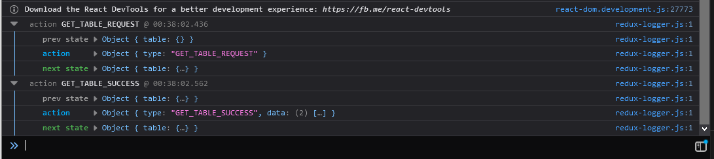

# Middlewares: Tracking State Changes (`redux-logger`)

Here we'll be setting up the `redux-logger` middleware. It provides standardized logging messages for every state change.

## What is a middleware?

It is a third-party functionality provided between the action and when it reaches the reducer.

## What does this solve?

The Redux middleware documentation has a nice example of how middleware help provide logging:

> One of the benefits of Redux is that it makes state changes predictable and transparent. Every time an action is dispatched, the new state is computed and saved. The state cannot change by itself, it can only change as a consequence of a specific action.
>
> Wouldn't it be nice if we logged every action that happens in the app, together with the state computed after it? When something goes wrong, we can look back at our log, and figure out which action corrupted the state.

Redux Middleware docs: [https://redux.js.org/advanced/middleware/#problem-logging](https://redux.js.org/advanced/middleware/#problem-logging)

<hr />

## Setup

Great. Now let's throw it in our app!

### Install `redux-logger`

It should already be installed if the "in-depth tutorial" was followed, but we'll include it here for completeness.

```bash
npm install --save redux-logger
```

In our `store.js` we need to import the `createLogger` object, and create an instance of it.

```js
import { createLogger } from 'redux-logger';

const loggerMiddleware = createLogger();
```

Next, add it _to the **end** of the `applyMiddleware()` call_.

> From the `reudx-logger` repo
> Note: logger must be the last middleware in chain, otherwise it will log thunk and promise, not actual actions (#20).
> - [https://github.com/LogRocket/redux-logger](https://github.com/LogRocket/redux-logger)
> - [https://github.com/LogRocket/redux-logger/issues/20](https://github.com/LogRocket/redux-logger/issues/20)

So, all together, our new `store.js` looks like this.

_*src/_helpers/store.js*_

```js
import { createStore, applyMiddleware, combineReducers } from 'redux';
import thunkMiddleware from 'redux-thunk';
import { createLogger } from 'redux-logger';
import { table } from '../table/reducers';

const loggerMiddleware = createLogger();
const rootReducer = combineReducers({
	table
});

export const store = createStore(
	rootReducer,
	applyMiddleware(thunkMiddleware, loggerMiddleware)
);
```

## View Logs

Open the console in Dev Tools in your browser, and you should see messages similar to the following.

