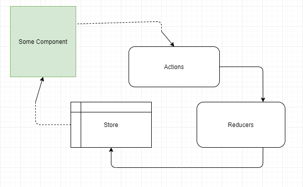
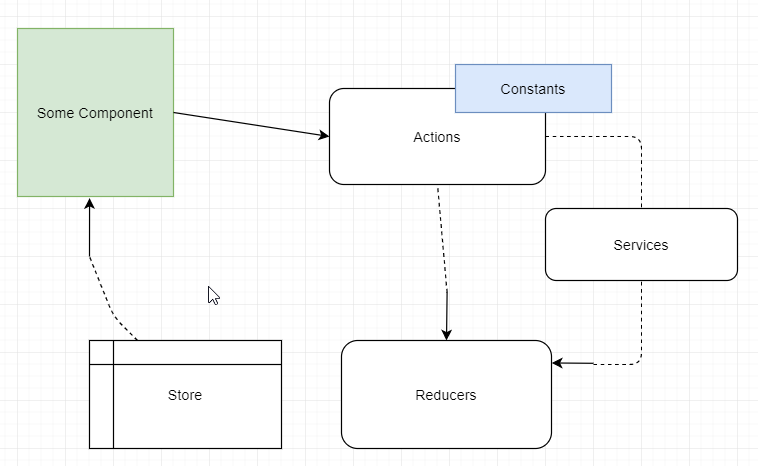

# Redux: Data Flow Primer

Redux is a state management library for JavaScript applications. It isn't created exclusively for React, but works quite well with it. It solves the problem of allowing components to communicate in a one-way data flow while maintaining data in a central location.

Below is a primer on the general flow of how data moves through redux's major pieces.

## Core Pieces

Redux is comprised of three core pieces.

- Actions
- Reducers
- Store

There is a **store** where our data is located, and is the source of data for our components. **Actions** are triggered to start moving data and describe the *action* that was taken--by the user or by the application. Finally, **reducers** manage how the data is transformed in the **store**.

*NOTE: Reducers get their strange name from being built as an abstraction on top of the `Array.reduce()` method.*

Keep in mind, React requires data to *flow in one direction* and *be immutable*. So, how do these pieces work together?

## Practical ~~Core~~ Pieces

Before things become simple we're going to complicate them by adding a couple pieces: **constants** and **services**.

- Actions
- Constants*
- Services*
- Reducers
- Store

**Constants** are simply string constants. We will use them to centralize the descriptions we use in our **actions**.

**Services** are simply where the request/response to external resources (i.e. HTTP calls) is handled. 

Imagine the communication between the moving pieces looks a little like this:

- component says, "Ok, I need to do a thing. I'll trigger an *action*."
- an **action** describes, "go get `<data>` from /api/endpoint."
- a **service** handles data via [axios](https://github.com/axios/axios), [fetch API](https://developer.mozilla.org/en-US/docs/Web/API/Fetch_API/Using_Fetch), etc., "hey, API...you there? I need `<data>`."
- the **reducer** organizes, "hm, yes...`<data>` fits nicely right here."
- the **store**, "Thank you, reducer. Yes, I sit and I know--*more*--things."
- component says, "Cool. I have the data I need now!"

